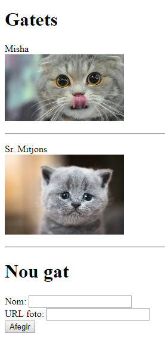

Pràctiques bloc 7
===================

Gatets _(pràctica no avaluable)_
---------------------

Una de les coses més guays d'Internet son les fotos de gats. Et pots passar hores mirant-les i no et canses mai. Ho has provat?

Però a les hores de classe no!

Utilitzant un API REST, fes un web que permeti emmagatzemar gatets, en concret el seu nom i una url de la seva foto. Únicament heu de permetre que es donin d'alta nous gats (no cal editar ni eliminar).

Assegura't que, si tanques el navegador i el tornes a obrir, els gats encara hi son.

El web ha de quedar semblant al següent:

```
GATETS
======

Sr. Mitjons
+------------------+
|                  |
| Foto Sr. Mitjons |
|                  |
+------------------+

---------------------------

Cacauet
+--------------+
|              |
| Foto Cacauet |
|              |
+--------------+

---------------------------

NOU GAT
=======
Nom: _______
URL foto: _______
[AFEGIR]
```

