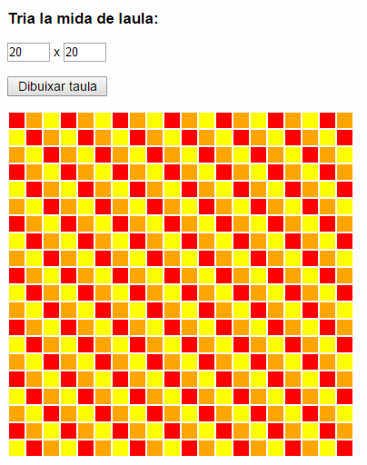

Taula de colors
===================
> Aquesta pràctica s'haurà de lliurar i s'avaluarà.

Crea un web que, mitjançant JavaScript, dibuixi una taula de les dimensions indicades seguint una seqüència de colors determinada.

Un cop completada la seqüència, aquesta s'ha de repetir fins a omplir totes les cel·les de la taula.

La mida de la taula haurà d'estar entre 1x1 i 50x50.

Fent clic a un botó es dibuixarà a la taula la seqüència de colors donada.

Es valorarà que el programa estigui preparat per poder afegir més colors a triar d'una forma senzilla.

Recorda: centra't en que el codi sigui **clar**, **correcte** i **robust**.

Tots els fitxers que generis han d'estar dins d'un directori anomenat `uf2`